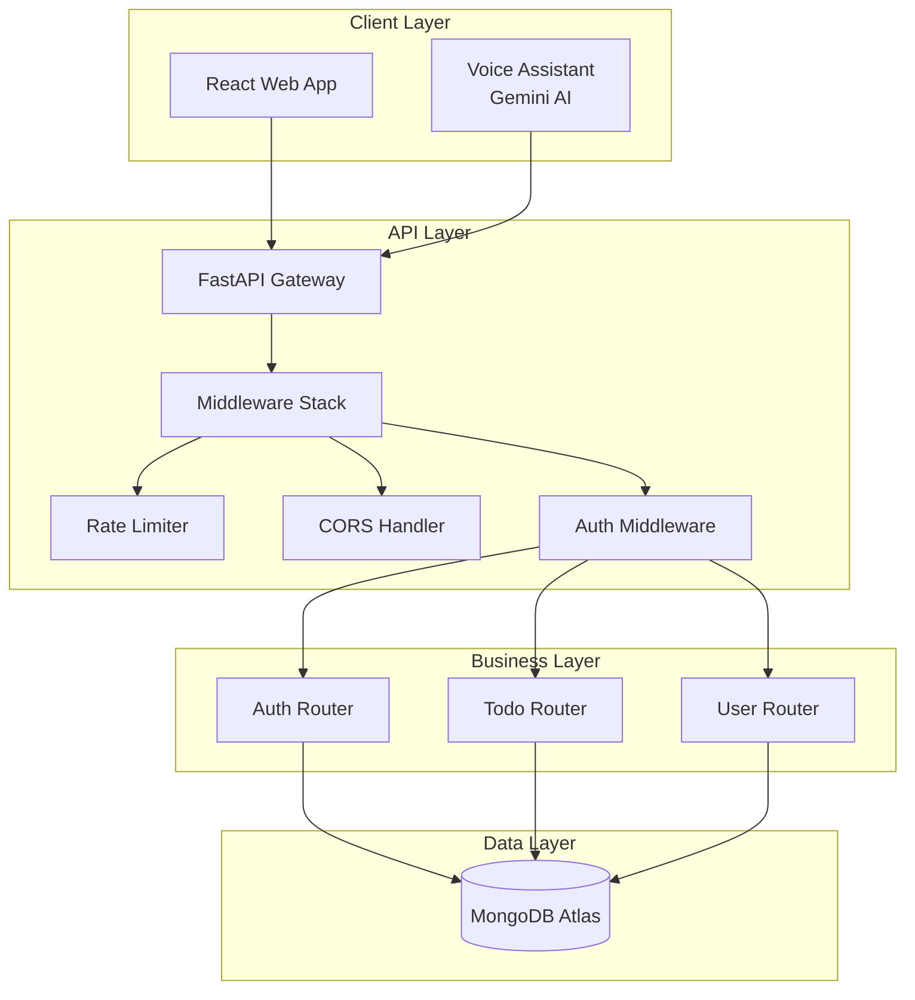
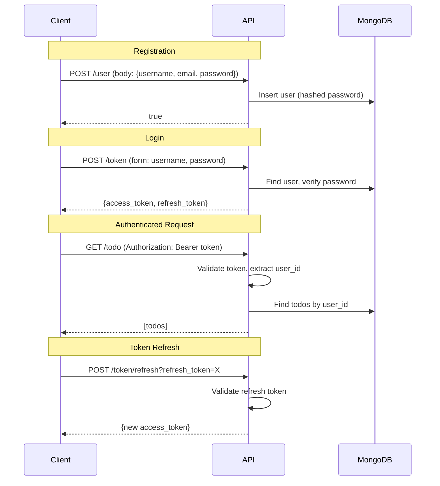
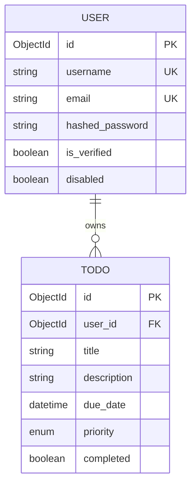

# FastTodo System Specification

> **Living Document** | Last Updated: 2025-12-21
> This is the canonical reference for the FastTodo system architecture, design decisions, and known challenges.

---

## Table of Contents

1. [System Overview](#system-overview)
2. [Architecture](#architecture)
3. [Component Specifications](#component-specifications)
4. [API Contract](#api-contract)
5. [Data Models](#data-models)
6. [Security Architecture](#security-architecture)
7. [Known Architectural Pitfalls](#known-architectural-pitfalls)
8. [Technical Debt Registry](#technical-debt-registry)
9. [Evolution Roadmap](#evolution-roadmap)

---

> [!CAUTION]
> ## 🚨 Development Workflow - READ THIS FIRST
>
> **For AI Agents and Developers:**
> This ARCHITECTURE.md is the **single source of truth** for architectural decisions. You MUST follow this workflow:
>
> ```
> 1. Architecture Discussion → Update ARCHITECTURE.md
> 2. Create ADR (Architecture Decision Record)
> 3. Implement code
> ```
>
> **❌ DO NOT:**
> - Jump straight to coding without updating ARCHITECTURE.md
> - Create code before ADR for architectural changes
> - Make architectural decisions without discussion
>
> **✅ DO:**
> - Add new architectural concerns to "Known Architectural Pitfalls"
> - Document decisions in "Architectural Decisions Summary"
> - Update Technical Debt Registry with effort estimates
> - Create ADR referencing ARCHITECTURE.md decisions
> - Only then implement
>
> **Why:** This prevents technical debt, ensures decisions are documented with context, and helps future maintainers understand the "why" behind choices.

---

## System Overview

### Purpose
FastTodo is a production-grade todo management application demonstrating modern web development practices with AI-assisted development workflows.

### Repositories

| Repository | Purpose | Tech Stack |
|------------|---------|------------|
| [sajankp/to-do](https://github.com/sajankp/to-do) | Backend API | FastAPI, MongoDB, Python 3.13 |
| [sajankp/to-do-frontend](https://github.com/sajankp/to-do-frontend) | Web Client | React 19, TypeScript, Vite |

### Deployment

| Environment | Backend | Frontend |
|-------------|---------|----------|
| Production | https://to-do-4w0k.onrender.com | TBD |
| Local Dev | http://localhost:8000 | http://localhost:3000 |

---

## Architecture

### System Diagram



### Current Architecture Pattern

**Monolithic API with Direct Database Access**

```
Routers → MongoDB (Direct)
```

This is the simplest pattern but has limitations at scale.

### Target Architecture Pattern

**Layered Architecture with Repository Pattern**

```
Routers → Services → Repositories → MongoDB
```

This provides:
- Testability (mock repositories)
- Separation of concerns
- Database abstraction

---

## Component Specifications

### Backend Components

| Component | Location | Responsibility |
|-----------|----------|----------------|
| `main.py` | `app/main.py` | Application entry, middleware stack, root endpoints |
| `config.py` | `app/config.py` | Environment configuration via Pydantic Settings |
| `auth.py` | `app/routers/auth.py` | JWT token creation, password hashing, user lookup |
| `todo.py` | `app/routers/todo.py` | Todo CRUD operations |
| `user.py` | `app/routers/user.py` | User profile endpoints |
| `mongodb.py` | `app/database/mongodb.py` | MongoDB client initialization |

### Frontend Components

| Component | Location | Responsibility |
|-----------|----------|----------------|
| `App.tsx` | Root | Auth state management, route switching |
| `AuthForm.tsx` | `components/` | Login/registration forms |
| `TodoList.tsx` | `components/` | Todo CRUD UI, filtering, search |
| `VoiceAssistant.tsx` | `components/` | Gemini AI voice control |
| `api.ts` | `services/` | API client, auth headers, error handling |

---

## API Contract

### Authentication Flow



### Endpoints Summary

| Method | Endpoint | Auth | Rate Limit | Description |
|--------|----------|------|------------|-------------|
| POST | `/token` | ❌ | 5/min | Login, get tokens |
| POST | `/token/refresh` | ❌ | 5/min | Refresh access token |
| POST | `/user` | ❌ | 5/min | Register new user |
| GET | `/user/me` | ✅ | 100/min | Get current user profile |
| GET | `/todo/` | ✅ | 100/min | List user's todos |
| POST | `/todo/` | ✅ | 100/min | Create todo |
| GET | `/todo/{id}` | ✅ | 100/min | Get specific todo |
| PATCH | `/todo/{id}` | ✅ | 100/min | Update todo |
| DELETE | `/todo/{id}` | ✅ | 100/min | Delete todo |
| GET | `/health` | ✅ | - | Health check |

---

## Data Models

### User Model

```python
class UserInDB:
    id: ObjectId           # MongoDB _id
    username: str          # Unique, required
    email: EmailStr        # Unique, required
    hashed_password: str   # bcrypt hash
    is_verified: bool      # Email verification status (default: False)
    disabled: bool         # Account status (default: False)
    created_at: datetime   # Auto-set
    updated_at: datetime   # Auto-updated
```

### Todo Model

```python
class TodoInDB:
    id: ObjectId           # MongoDB _id
    user_id: ObjectId      # Owner reference
    title: str             # 1-100 chars, required
    description: str       # 0-500 chars
    due_date: datetime     # Optional, must be future
    priority: Enum         # low | medium | high
    completed: bool        # Completion status (default: False)
    created_at: datetime   # Auto-set
    updated_at: datetime   # Auto-updated
```

### Model Relationships



---

## Security Architecture

### Authentication

| Aspect | Implementation |
|--------|----------------|
| Algorithm | HS256 (HMAC-SHA256) |
| Access Token TTL | 30 minutes |
| Refresh Token TTL | 1 hour |
| Password Hashing | bcrypt with salt |
| Token Storage | Client-side (localStorage) |

### Authorization

| Rule | Implementation |
|------|----------------|
| User Isolation | Todos filtered by `user_id` from JWT |
| Ownership Check | Update/delete verify `todo.user_id == request.user_id` |
| Middleware | All routes except whitelist require valid JWT |

### Rate Limiting

| Endpoint Type | Limit | Strategy |
|---------------|-------|----------|
| Auth endpoints | 5/minute | IP-based |
| API endpoints | 100/minute | IP-based |
| Storage | In-memory (Redis optional) |

---

## Known Architectural Pitfalls

> [!CAUTION]
> These are architectural concerns that should be addressed before scaling.

### 1. (TD-001) Synchronous Database Operations

**Current State:**
```python
# All DB calls block the event loop
result = request.app.todo.insert_one(todo_dict)  # Blocking!
```
**Risk:**
- Under high load, blocked threads exhaust worker pool
- 100+ concurrent users could cause timeouts
- FastAPI's async benefits negated

**Mitigation:**
- Migrate to Motor (async MongoDB driver)
- Requires all route handlers become `async def`
- Estimated effort: 2-3 days

---

### 2. (TD-002) No Database Indexes

**Current State:**
- No indexes defined on collections
- Every query does collection scan

**Risk:**
- O(n) query time as data grows
- 10,000+ todos = noticeable latency

**Mitigation:**
```python
# Recommended indexes
todos.create_index([("user_id", 1)])
todos.create_index([("user_id", 1), ("priority", 1)])
todos.create_index([("user_id", 1), ("due_date", 1)])
users.create_index([("username", 1)], unique=True)
users.create_index([("email", 1)], unique=True)
```

---

### 3. (TD-003) Token in localStorage (XSS Vulnerable)

**Current State:**
```typescript
localStorage.setItem('token', response.access_token);
```

**Risk:**
- XSS attack can steal tokens
- No way to revoke tokens server-side

**Mitigation Options:**
1. **HttpOnly cookies** - Prevents XSS access
2. **Token rotation** - Limit damage window
3. **Token blacklist** - Server-side revocation

---

### 4. (TD-004) No Email Uniqueness Enforcement

**Current State:**
```python
def create_user(username: str, email: str, password: str):
    # No check for duplicate email
    user = CreateUser(username=username, email=email, ...)
    result = request.app.user.insert_one(user.model_dump())
```

**Risk:**
- Same email can register multiple times
- Password reset will be ambiguous
- Email verification won't work properly

**Mitigation:**
1. Add unique index on email field
2. Check before insert, return 409 Conflict
3. Consider username uniqueness too

---

### 5. (TD-005) Missing Request Validation Limits

**Current State:**
- No max request body size
- No timeout on long-running requests

**Risk:**
- Large payload DoS attacks
- Memory exhaustion

**Mitigation:**
```python
# In uvicorn/nginx config
limit_request_body_size = 1MB
request_timeout = 30s
```

---

### 6. (TD-008) Frontend Token Refresh Not Implemented

**Current State:**
```typescript
// Token expires → User silently logged out
// No automatic refresh attempt
```

**Risk:**
- Poor UX (30-min session hard limit)
- Users lose work if editing when token expires

**Mitigation:**
```typescript
// Intercept 401, attempt refresh, retry request
const fetchWithAuth = async (url, options) => {
  let response = await fetch(url, options);
  if (response.status === 401) {
    const refreshed = await refreshToken();
    if (refreshed) response = await fetch(url, options);
  }
  return response;
};
```

---

### 7. (TD-009) No API Versioning

**Current State:**
```
GET /todo/
```

**Risk:**
- Breaking changes affect all clients
- No deprecation path

**Mitigation:**
```
GET /v1/todo/
GET /v2/todo/  # New format
```

---

### 8. Hardcoded Configuration in Frontend

**Current State:**
```typescript
const BASE_URL = import.meta.env.VITE_API_URL || 'http://localhost:8000';
```

**Status:** ✅ Fixed (was hardcoded to production URL)

---

### 9. Password Visible in Query String

**Current State:**
```python
# Registration endpoint
POST /user?username=X&email=Y&password=Z
```

**Risk:**
- Passwords logged in server access logs
- Visible in browser history
- Cached by proxies

**Mitigation:**
- Change to request body: `POST /user` with JSON body
- Backend change required

---

### 10. (TD-003) Missing Security Headers Middleware

**Current State:**
- No security headers middleware configured
- Default headers expose server information
- Missing OWASP recommended headers

**Risk:**
- Vulnerable to clickjacking (no `X-Frame-Options`)
- XSS attacks easier without CSP
- MIME sniffing vulnerabilities
- Missing HSTS for HTTPS enforcement

**Required Headers:**
```python
# Example headers to implement
X-Frame-Options: DENY
X-Content-Type-Options: nosniff
X-XSS-Protection: 1; mode=block
Strict-Transport-Security: max-age=31536000; includeSubDomains
Content-Security-Policy: default-src 'self'
Referrer-Policy: strict-origin-when-cross-origin
```

**Mitigation:**
```python
# Add middleware in main.py
from fastapi.middleware.trustedhost import TrustedHostMiddleware
from fastapi.middleware.httpsredirect import HTTPSRedirectMiddleware

@app.middleware("http")
async def add_security_headers(request: Request, call_next):
    response = await call_next(request)
    response.headers["X-Frame-Options"] = "DENY"
    response.headers["X-Content-Type-Options"] = "nosniff"
    response.headers["X-XSS-Protection"] = "1; mode=block"
    # Add remaining headers
    return response
```

**Priority:** High (production blocker)

---

### 11. (TD-004) No Structured Logging

**Current State:**
```python
# Current: Basic print/logging
logging.info("User logged in")  # No context, no correlation
```

**Risk:**
- Can't trace requests across services
- No user/session context in logs
- Hard to debug production issues
- Can't correlate errors with specific requests

**Mitigation:**
```python
# Structured logging with context
import structlog

logger = structlog.get_logger()

@app.middleware("http")
async def logging_middleware(request: Request, call_next):
    correlation_id = str(uuid.uuid4())
    structlog.contextvars.bind_contextvars(
        correlation_id=correlation_id,
        path=request.url.path,
        method=request.method,
    )

    logger.info("request_started")
    response = await call_next(request)
    logger.info("request_completed", status_code=response.status_code)

    return response

# Usage in routes
logger.info("todo_created", user_id=user_id, todo_id=todo_id)
```

**Benefits:**
- JSON formatted logs (machine readable)
- Correlation IDs for request tracing
- Automatic context injection
- Easy to search/filter in log aggregators

**Priority:** High (required for production debugging)

---

### 12. (TD-005) Missing Monitoring & Observability

**Current State:**
- No metrics collection
- No alerting
- No performance monitoring
- Basic health check only

**Risk:**
- No visibility into production performance
- Can't detect degradation before failure
- No capacity planning data
- Manual incident detection only

**Mitigation - Prometheus Metrics:**
```python
from prometheus_client import Counter, Histogram, generate_latest

# Define metrics
request_count = Counter('http_requests_total', 'Total HTTP requests', ['method', 'endpoint', 'status'])
request_duration = Histogram('http_request_duration_seconds', 'HTTP request duration')
db_query_duration = Histogram('db_query_duration_seconds', 'Database query duration')

@app.middleware("http")
async def metrics_middleware(request: Request, call_next):
    start_time = time.time()
    response = await call_next(request)
    duration = time.time() - start_time

    request_count.labels(
        method=request.method,
        endpoint=request.url.path,
        status=response.status_code
    ).inc()
    request_duration.observe(duration)

    return response

@app.get("/metrics")
def metrics():
    return Response(generate_latest(), media_type="text/plain")
```

**Grafana Dashboards:**
- Request rate (req/sec)
- Error rate (4xx, 5xx)
- Response time (p50, p95, p99)
- Database query performance
- Active users

**Alerting Rules:**
- Error rate > 5%
- Response time p95 > 500ms
- Database connection pool exhausted

**Priority:** Critical (cannot operate production without this)

---

### 13. (TD-006) Gemini API Key Exposed in Frontend Bundle

**Current State:**
```typescript
// VoiceAssistant.tsx
const ai = new GoogleGenAI({ apiKey: process.env.API_KEY });

// vite.config.ts - This bundles the key into client JS
'process.env.API_KEY': JSON.stringify(env.GEMINI_API_KEY)
```

**Risk:**
- API key visible in browser DevTools → Sources → bundled JavaScript
- Anyone can extract and abuse the key
- No usage tracking or rate limiting per user
- Potential for significant API cost abuse

**Architectural Solutions for Discussion:**

#### Option A: Backend Proxy (Recommended)
```
Frontend → Backend /api/ai/voice → Gemini API
```

**Pros:**
- API key never leaves server
- Can add per-user rate limiting
- Can log AI usage per user
- Can inject user context into prompts
- Can add cost controls

**Cons:**
- Adds latency (extra hop)
- Backend becomes stateful for WebSocket/streaming
- More backend complexity

**Implementation:**
```python
# New endpoint in backend
@router.post("/ai/voice")
async def proxy_gemini_voice(
    request: Request,
    prompt: str,
    user_id: str = Depends(get_current_user)
):
    # Rate limit per user
    # Log usage
    # Forward to Gemini
    # Return response
```

#### Option B: Serverless Edge Function
```
Frontend → Vercel/Netlify Edge Function → Gemini API
```

**Pros:**
- Low latency (edge deployment)
- Separate from main backend
- Easy to deploy

**Cons:**
- Another service to manage
- Harder to integrate with user auth
- Separate rate limiting logic

#### Option C: Google AI Studio Integration Only
```
Frontend → window.aistudio API (when available)
```

**Pros:**
- No key management needed
- Works in AI Studio environment

**Cons:**
- Only works in AI Studio
- Doesn't work for deployed app
- Not a production solution

**Decision: ✅ Option A (Backend Proxy)**

We will implement a backend proxy endpoint for Gemini API calls. This:
- Prevents API key exposure in frontend bundle
- Enables per-user rate limiting and usage tracking
- Allows cost controls and monitoring
- Keeps all authentication logic centralized

**Implementation Priority:** Critical (TD-003)

---

### 14. (TD-007) Frontend Linting & Code Quality Enforcement

**Current State:**
- Backend has `.pre-commit-config.yaml` with Ruff linting
- Frontend has **no** pre-commit hooks or linting enforcement
- No consistent code formatting

**Risk:**
- Code quality drift
- Inconsistent formatting across contributors
- Bugs that linters would catch

**Proposed Solution for Discussion:**

#### Setup ESLint + Prettier + Husky

```json
// package.json additions
{
  "devDependencies": {
    "eslint": "^9.0.0",
    "@typescript-eslint/eslint-plugin": "^8.0.0",
    "@typescript-eslint/parser": "^8.0.0",
    "prettier": "^3.0.0",
    "husky": "^9.0.0",
    "lint-staged": "^15.0.0"
  },
  "scripts": {
    "lint": "eslint . --ext ts,tsx",
    "format": "prettier --write \"**/*.{ts,tsx,json,md}\"",
    "prepare": "husky install"
  }
}
```

#### Pre-commit Hook
```bash
# .husky/pre-commit
npm run lint
npm run format
```

**Assessment Results (2025-12-21):**

Ran strict ESLint + TypeScript on current codebase:
- **ESLint**: 13 errors across 4 files
  - 8× `no-explicit-any` (mostly in VoiceAssistant.tsx with Gemini SDK)
  - 5× `no-unused-vars` (simple cleanup)
- **TypeScript --strict**: 50+ errors, but mostly due to missing `@types/react`

**Decision: ✅ Phased Approach (Not Strict Upfront)**

The codebase is relatively clean (only 13 linting issues). Enforcing strict rules immediately would be too aggressive for experimental features like voice assistant.

**Phase 1: Foundation (Week 1)**
- Install missing type definitions (`@types/react`, `@types/react-dom`)
- Add Prettier for consistent formatting
- Add commitlint for conventional commit enforcement
- Fix 5 unused import errors

**Phase 2: Gradual Strictness (Week 2-3)**
- Add ESLint with **warnings** (not errors) for `any` types
- Fix 2 easy `any` errors in `api.ts` and `AuthForm.tsx`
- Leave VoiceAssistant `any` types temporarily (complex Gemini SDK)

**Phase 3: Full Enforcement (Month 2)**
- Enable strict TypeScript mode
- Properly type Gemini SDK interactions
- Add pre-commit hooks that block on errors

**Rationale:**
- Backend can be stricter (Python + Ruff are simpler)
- Frontend has external SDKs with complex types
- Voice assistant is experimental/AI-generated code
- Incremental improvement > all-or-nothing

---

## Architectural Decisions Summary

> [!NOTE]
> Individual architectural decisions are documented in [ADRs](adr/).
> See [ADR Index](adr/README.md) for the complete list (ADR-001 through ADR-009).

---

## Technical Debt & Roadmap

> [!NOTE]
> Technical debt registry and evolution roadmap are maintained in [ROADMAP.md](ROADMAP.md).

---

## Cross-References

- [Backend README](../README.md)
- [Agent Context](../AGENTS.md)
- [Project Roadmap](ROADMAP.md)
- [ADRs](adr/)
- [API Documentation](https://to-do-4w0k.onrender.com/docs)
- [Frontend Repository](https://github.com/sajankp/to-do-frontend)

---

*This document should be updated when architectural decisions are made or pitfalls are addressed.*
